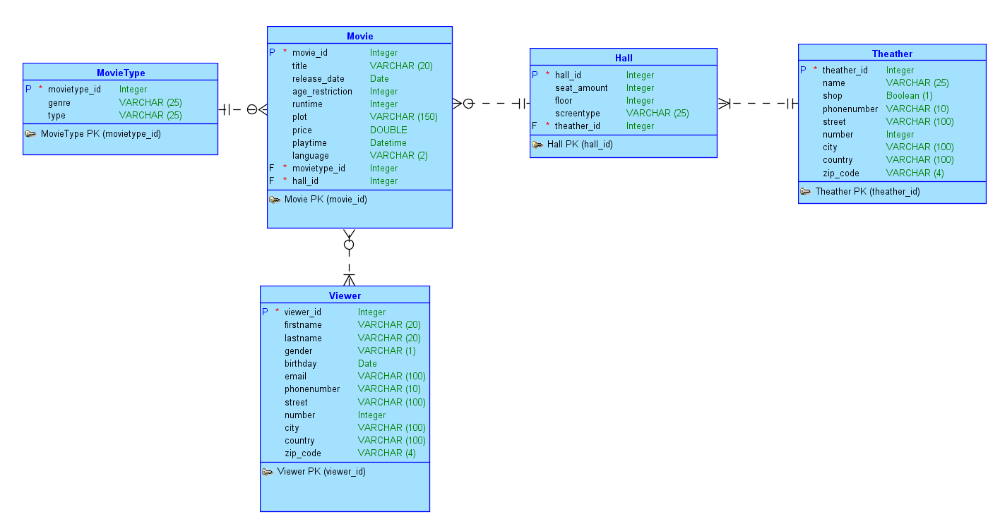

Milestone 2: Modellering
---
TOP DOWN MODELERING
---

Conceptueel Model
---

    Entiteittypes + Attributen + PK
---
- Movie ( **movie_id**, title, release_date, genre, type, runtime, plot, language)
- Reviewer (**reviewer_id**, firstname, lastname, stars, comment, published, email)
- Actor ( **actor_id**, firstname, lastname, email, phonenumber, street, number, city, country, zip_code, gender, birthday)
- Hall (**hall_id**, amount_seats, floor, screentype)
- Theather (**theather_id**, name, shop, phonenumber, street, number, city, country, zip_code)

    Domeinen - constraints
---
- reviewer_id: stars - maximum 5
- Actor: gender - M, W or X
- Actor: Email must contain @

    Tijd
---
- Movie: release_date

    Conceptueel ERD
---

Logisch Model
---

    Intermediërende  entiteiten
---
- Review: Reviewer - Movie
- Contract: Actor - Movie

    Logisch ERD
---

Verschillen na Normalisatie
---
- Extra entiteit: Zipcodes
- Extra entities: Countries
- Extra entities: movie_genre
- Extra entities: movie_type
- Extra entities: screentype
- Extra entities: performancetype

