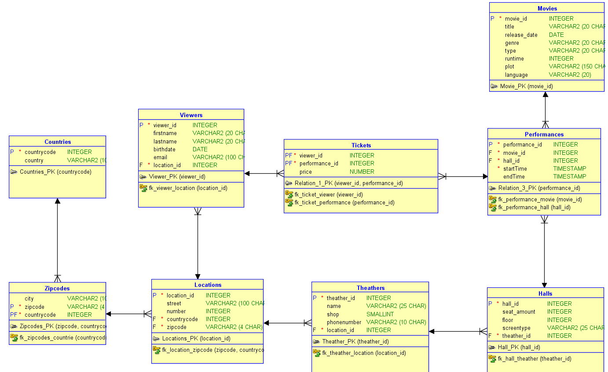

Milestone 2: Modellering
---
TOP DOWN MODELERING
---

Conceptueel Model
---

    Entiteittypes + Attributen + PK
---
- Vehicle ( **vehicle_id**, manual, purchasedate, licenseplate, mileage, model, brand, categorie)
- Rentor (**studio_id**, studio_name, studio_adress)
- Player ( **player_id**, player_name, highscore, start_date, end_date, email, street, housenumber, zip_code, city, country)
- Influencer_youtubechannel(**channel_id**, channel_name, channel_url, subscriber_count)
- Influencer_youtubevideo(**video_id**, videotitle, viewer_count, video_url, duration)

    Domeinen - constraints
---
- Player: zipcodes - minimum 4 characters
- Player: email must contains @
- Computergame: release_date < last_updated

    Tijd
---
- Computergame: release_date
- Player: address when moving: start_date, end_date

    Conceptueel ERD
---

Logisch Model
---

    Intermediërende  entiteiten
---
- Player_locations: Players - Location
- Highscores: Players - Computergames

    Logisch ERD
---

Verschillen na Normalisatie
---
- Extra entiteit: Zipcodes
- Extra entities: Countries
- Tabel player_locations heeft gewijzigde samengestelde sleutel omdat je als speler bijvoorbeeld verschillende huureigendommen kunt hebben.
  - PK: (Player_id, location_id, startdatum)

