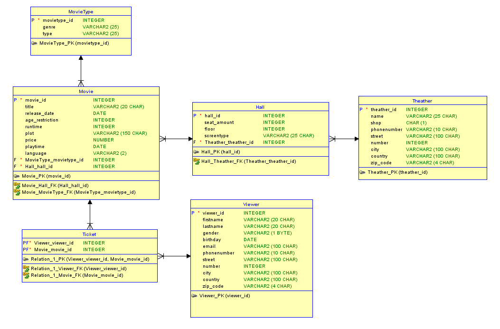

Milestone 2: Modellering
---
TOP DOWN MODELERING
---

Conceptueel Model
---

    Entiteittypes + Attributen + PK
---
- Viewer (**viewer_id**, gender, firstname, lastname, birthday, email, phonenumber, street, number, city, country, zip_code)
- Movie ( **movie_id**, title, release_date, age_restriction, runtime, plot, price, startTime, language)
- MovieType ( **movietype_id**, genre, type)
- Hall (**hall_id**, amount_seats, floor, screentype)
- Theather (**theather_id**, name, shop, phonenumber, street, number, city, country, zip_code)

    Domeinen - constraints
---
- Viewer: birthday < NOW()
- Viewer: gender - M, F or X
- Actor: Email must contain @

    Tijd
---
- Movie: release_date, startTime
- Viewer: birthday

    Conceptueel ERD
---

Logisch Model
---

    Intermediërende  entiteiten
---
- Ticket: Viewer - Movie

    Logisch ERD
---

Verschillen na Normalisatie
---
- Extra entiteit: Zipcodes
- Extra entities: Countries
- Extra entities: Locations
- Tabel tickets heeft gewijzigde samengestelde sleutel omdat je als viewer bijvoorbeeld dezelfde film kunt kijken in dezelfde zaal op een ander moment.
  - PK: (viewer_id, movie_id, startTime)

