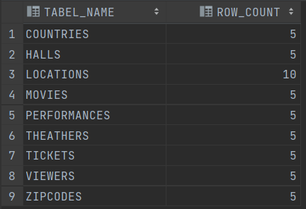
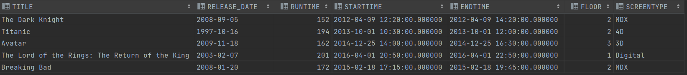
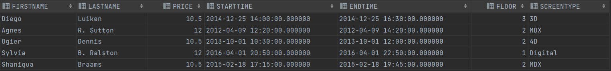
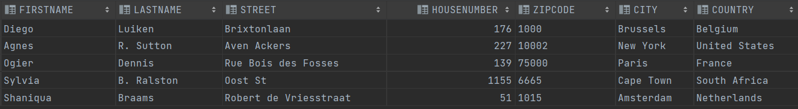
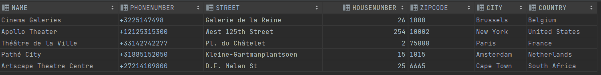
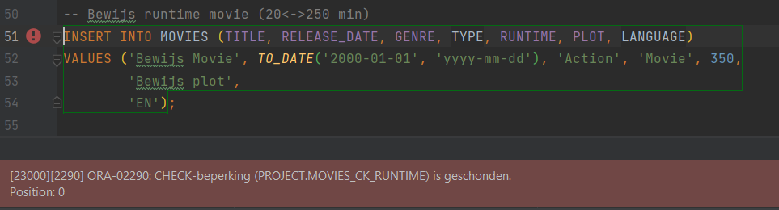
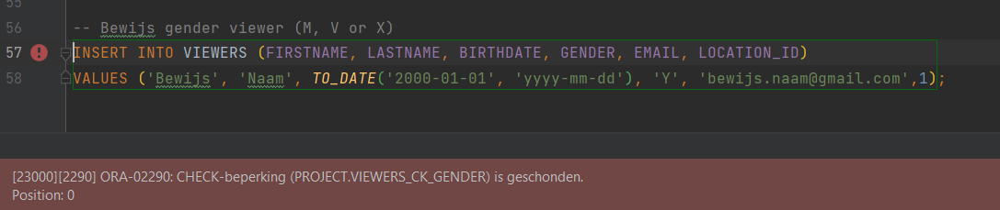
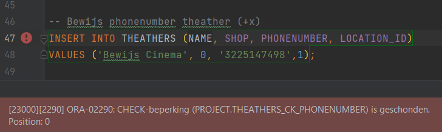

Milestone 3: Creatie Databank
---

    Identity columns
---
- Mandatory
  - Movie: MOVIE_ID
  - Viewer: VIEWER_ID
  - Theather: THEATHER_ID
  - Halls: HALL_ID
- other:
  - Performances: PERFORMANCE_ID
  - Locations: LOCATION_ID

      Table Counts
---

    @query 1: Relatie Veel-op-veel

	SELECT m.TITLE, m.RELEASE_DATE, m.RUNTIME, p.STARTTIME, p.ENDTIME, h.FLOOR, h.SCREENTYPE
	FROM MOVIES m
	JOIN PERFORMANCES p ON m.MOVIE_ID = p.MOVIE_ID
	JOIN HALLS h ON p.HALL_ID = h.HALL_ID;
--- 

    @query 2: 2 niveau’s diep

	SELECT v.FIRSTNAME,v.LASTNAME, t.PRICE, p.STARTTIME, p.ENDTIME, h.FLOOR, h.SCREENTYPE
	FROM VIEWERS v
        JOIN TICKETS t ON v.VIEWER_ID = t.VIEWER_ID
        JOIN PERFORMANCES p ON t.PERFORMANCE_ID = p.PERFORMANCE_ID
        JOIN HALLS h ON p.HALL_ID = h.HALL_ID;
--- 

    @query 3: viewer_locations

	SELECT v.FIRSTNAME,v.LASTNAME, l.STREET, l.HOUSENUMBER, z.ZIPCODE, z.CITY, c.COUNTRY
	FROM VIEWERS v
        JOIN LOCATIONS l ON v.LOCATION_ID = l.LOCATION_ID
        JOIN ZIPCODES z ON l.COUNTRYCODE = z.COUNTRYCODE AND l.ZIPCODE = z.ZIPCODE
        JOIN COUNTRIES c ON z.COUNTRYCODE = c.COUNTRYCODE;
--- 

    @query 4: theather_locations
	SELECT t.NAME,t.PHONENUMBER, l.STREET, l.HOUSENUMBER, z.ZIPCODE, z.CITY, c.COUNTRY
	FROM THEATHERS t
        JOIN LOCATIONS l ON t.LOCATION_ID = l.LOCATION_ID
        JOIN ZIPCODES z ON l.COUNTRYCODE = z.COUNTRYCODE AND l.ZIPCODE = z.ZIPCODE
        JOIN COUNTRIES c ON z.COUNTRYCODE = c.COUNTRYCODE;
--- 

  Bewijs Domeinen - constraints M2
--- 
    Movie: playtime between 30 and 200

---

    Viewer: gender - M, F or X

---

    Theather: Phonenumber must begin with +(32/31/etc)

---

